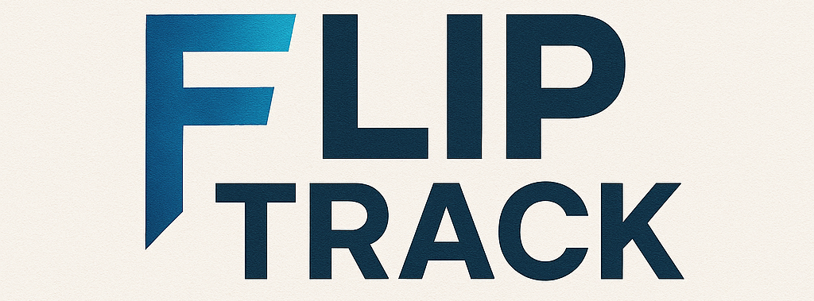
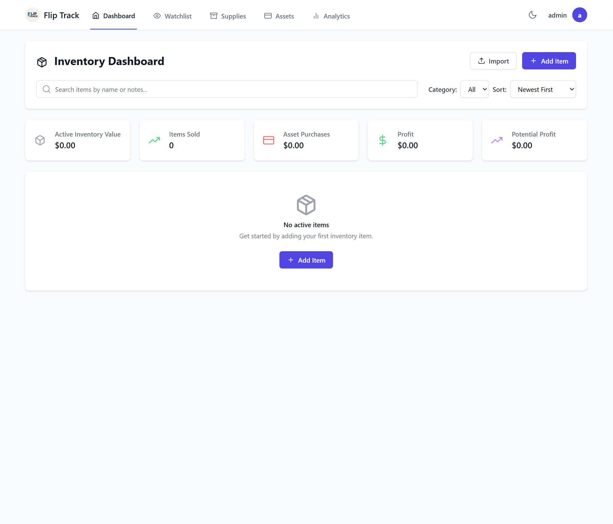
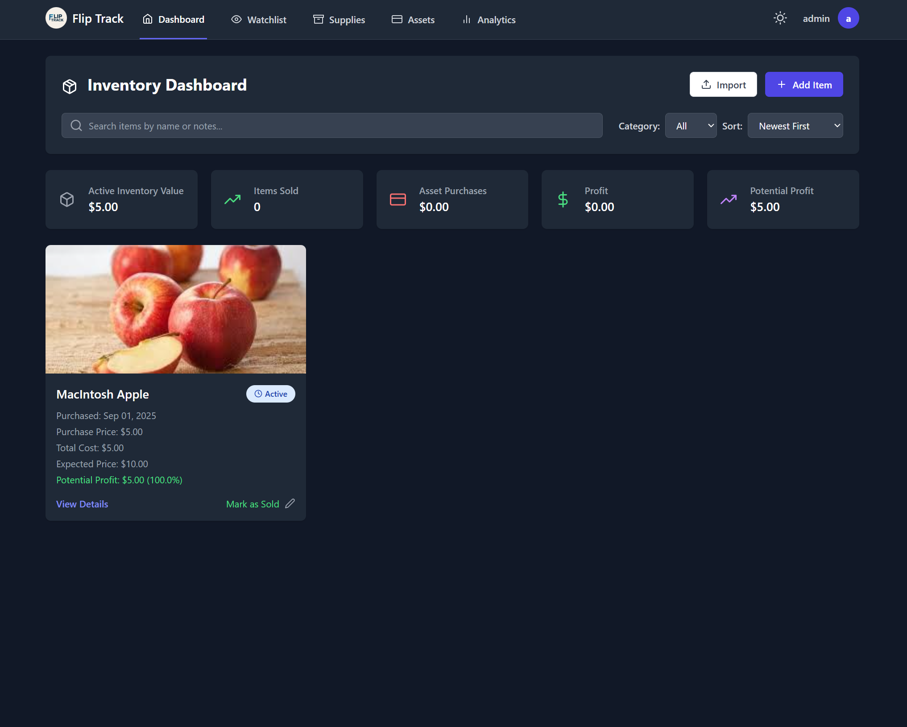
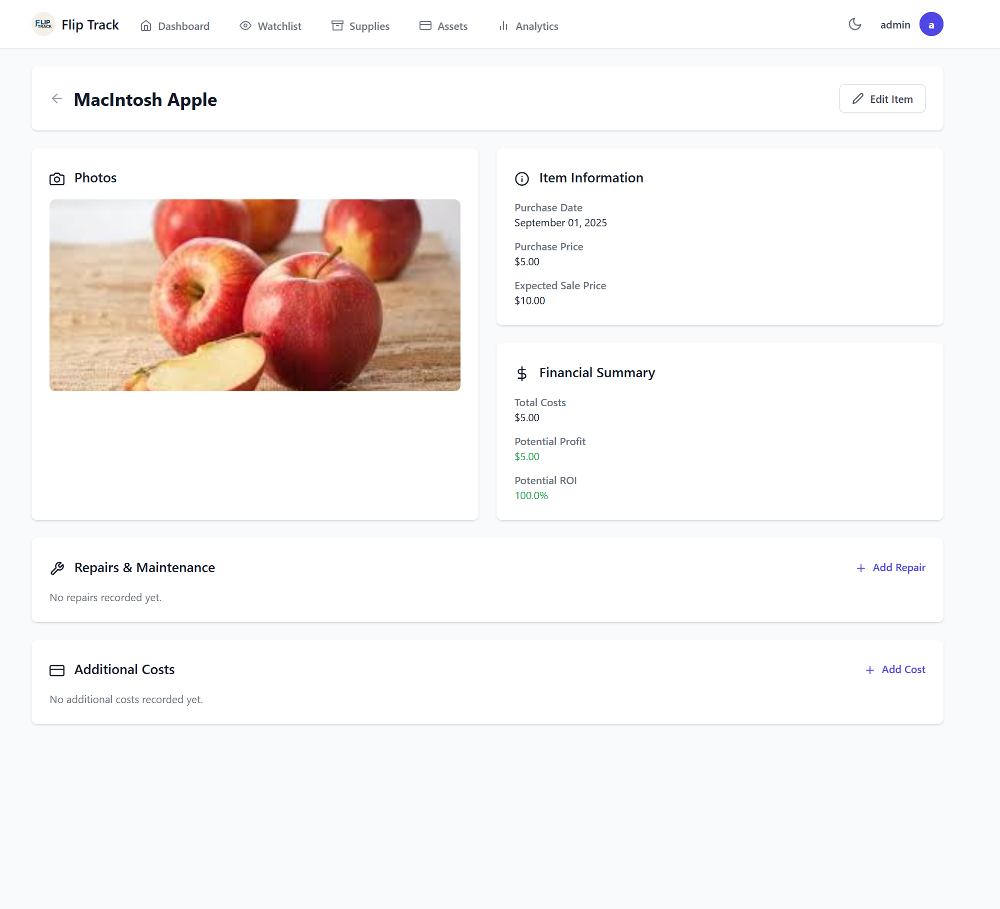

# Flip Track  



[Discord Support](https://discord.gg/5cC68aTMQS)


Flip Track is a modern, responsive web app designed to help ** flippers, resellers, and hobbyists** track their inventory, costs, profits, and ROI with ease. Whether you’re running a side hustle or managing a large inventory, Flip Track keeps everything organized in one clean dashboard.  

---

## ✨ Features  

- 📦 **Inventory Dashboard** – Manage active, sold, and archived items at a glance.  
- 💵 **Cost Tracking** – Record purchase prices, repairs, parts, paint, and other expenses.  
- 📊 **Profit & ROI** – Automatic margin and ROI calculations once an item is sold.  
- 🖼 **Image Uploads** – Multiple images per item with gallery & thumbnail views.  
- 🌗 **Dark/Light Mode** – Switchable themes for day or night use.  
- 🔎 **Watchlist** – Import and track auction lots (HiBid support included). (More websites to come) 
- 🔄 **Import/Export** – Backup or migrate data easily using .ZIP.  
- 📱 **Mobile-Friendly** – Designed to work seamlessly on both desktop and phone.  

---

## 🛠 Tech Stack  

| Layer       | Technology |
|-------------|------------|
| Backend     | Python, Flask |
| Database    | SQLite |
| Frontend    | HTML, CSS (Bootstrap), JavaScript |
| Optional    | Docker / aaPanel for deployment |

---

## 🚀 Getting Started  

### Installation  

```bash
git clone https://github.com/Huntsleyjr/Flip-Track.git
cd Flip-Track

python -m venv venv
source venv/bin/activate        # On Windows: venv\Scripts\activate
cd ..
pip install -r requirements.txt
cd FlipTrack
```

### Run the App  

```bash
flask run
```

Then visit: [http://localhost:5000](http://localhost:5000)  

---

## 📸 Screenshots  






---


## ⭐ Why Flip Track?  

- All-in-one solution for tracking flips  
- Automatic ROI calculations so you know what’s worth your time  
- Built for **speed, simplicity, and flexibility**  
- Open-source and fully customizable  

If you find this project useful, don’t forget to **star ⭐ the repo**!

---

## ☕ Support the Project  

If you find **Flip Track** helpful and want to support future development, you can **buy me a coffee** ❤️  

👉 [Donate via PayPal](https://www.paypal.me/CoastalCity)  
